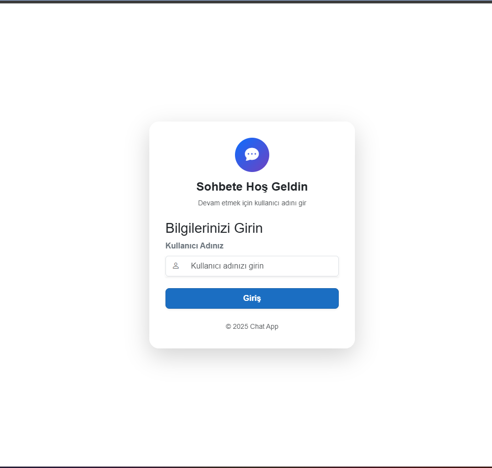
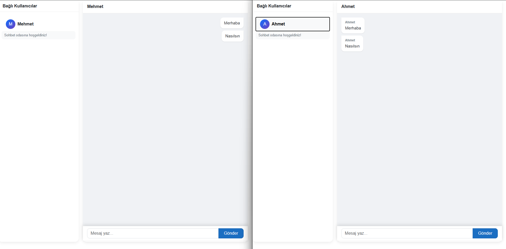

# Blazor ve SignalR ile Gerçek Zamanlı Sohbet Uygulaması

Bu proje, **.NET 9** kullanılarak geliştirilmiş, **Blazor Web App** ve **ASP.NET Core SignalR** teknolojilerinin birlikte nasıl çalıştığını gösteren örnek bir uygulamadır. Proje, sunucu ve istemci arasındaki gerçek zamanlı haberleşmeyi modern bir mimari ile sunar.

## Projenin Amacı ve Teknolojiler

Bu uygulamanın temel amacı, Blazor'ın bileşen tabanlı yapısı ile SignalR'ın anlık veri iletim yeteneklerini birleştirmektir. Uygulama, kullanıcının sayfa yenilemesine gerek kalmadan mesajlaşabilmesini, çevrimiçi kullanıcıları görebilmesini ve sistem bildirimlerini alabilmesini sağlar.

Kullanılan ana teknolojiler:
*   **Blazor Web App (Client):** Kullanıcı arayüzü ve istemci tarafı mantığı için.
*   **ASP.NET Core SignalR (Server):** İstemciler (clientlar) arasındaki iletişimi yöneten ve mesaj trafiğini sağlayan sunucu tarafı kütüphanesi.
*   **Shared Contracts:** Sunucu ve istemcinin ortak kullandığı, tip güvenliğini (type-safety) sağlayan veri modelleri ve arayüzler.

## SignalR ve Blazor Entegrasyonu Nasıl Çalışır?

Uygulamada iletişim şu prensipler üzerine kuruludur:

1.  **Bağlantı Kurulumu:**
    Kullanıcı arayüzde bir isim girip "Giriş" yaptığında, Blazor istemcisi arka planda çalışan SignalR sunucusuna (`ChatHub`) bir WebSocket bağlantısı başlatır. Bu bağlantı sırasında kullanıcı adı ve ID bilgileri sunucuya iletilir.

2.  **Hub (Merkez) Yapısı:**
    Sunucu tarafındaki `ChatHub` sınıfı, tüm bağlı kullanıcıları yönetir. Bir kullanıcı bağlandığında veya bağlantısı kesildiğinde, sunucu bu durumu algılar ve bağlı olan diğer tüm kullanıcılara güncel listeyi gönderir. Bu sayede "Bağlı Kullanıcılar" listesi her zaman güncel kalır.

3.  **Mesajlaşma Akışı:**
    *   Bir kullanıcı mesaj gönderdiğinde, bu istek önce sunucuya (Hub) gider.
    *   Sunucu, mesajın kime iletileceğini belirler.
    *   Hedef kullanıcının istemcisine, tanımlanmış olan `ReceiveMessage` metodu üzerinden veriyi anlık olarak iter (push eder).
    *   Blazor bileşeni bu olayı yakalar ve arayüzü güncelleyerek yeni mesajı ekranda gösterir.

4.  **Tip Güvenliği (Strongly Typed Hubs):**
    Projede `IChatClient` arayüzü kullanılarak, sunucunun istemcide hangi metotları tetikleyebileceği garanti altına alınmıştır. Bu, geliştirme sırasında hata yapma olasılığını düşürür ve kodun daha anlaşılır olmasını sağlar.

## Kurulum ve Çalıştırma

Projeyi çalıştırmak için iki ayrı terminalde sunucu ve istemciyi ayağa kaldırmanız gerekmektedir.

1.  **Sunucuyu Başlatın (HubServer):**
    `HubServer` klasörüne gidip `dotnet run` komutunu çalıştırın. Sunucu varsayılan olarak `http://localhost:5182` adresinden yayın yapacaktır.

2.  **İstemciyi Başlatın (BlazorChatApp):**
    `BlazorChatApp/BlazorChatApp` klasörüne gidip `dotnet run` komutunu çalıştırın. Uygulama `http://localhost:5114` adresinde açılacaktır.

Uygulamayı tarayıcıda açtıktan sonra farklı sekmelerde farklı kullanıcı adlarıyla giriş yaparak sohbeti test edebilirsiniz.
